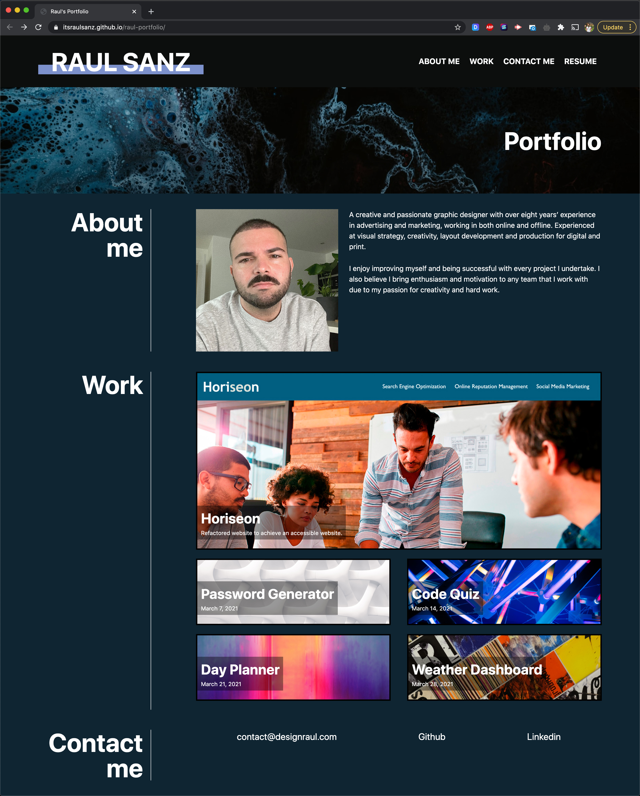
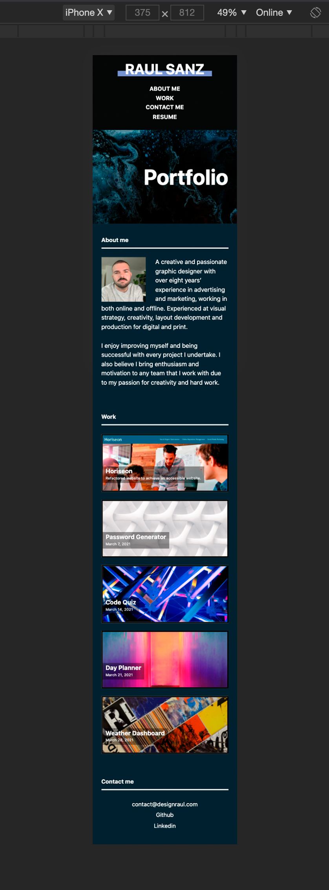

# Professional Portfolio

## Description

This repository contains my professional portfolio where I'll upload all my future projects. This has been built using flexbox, media queries and CSS variables.

## Mockup

This was the example provided:

## Style

The portfolio has been build from scratch following the same structure as the example showed above. However I have applied a different design (colours, size, font, hovers, etc.) to give it my own style.

## Deployed Application

Website URL: <a href="https://itsraulsanz.github.io/raul-portfolio/">https://itsraulsanz.github.io/raul-portfolio/</a>

